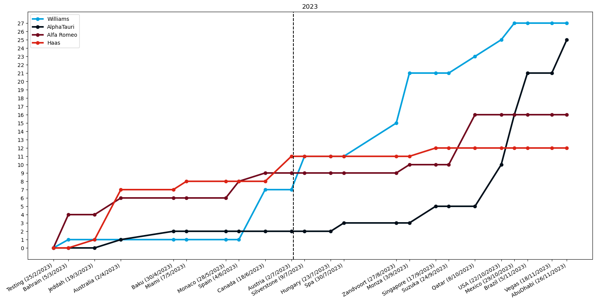
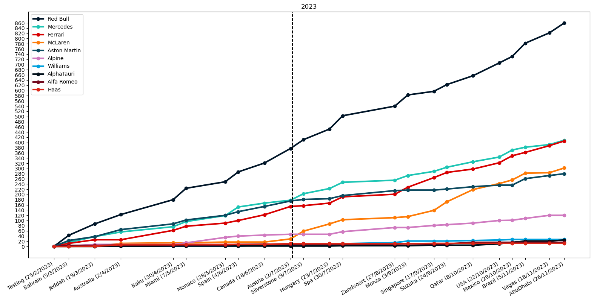
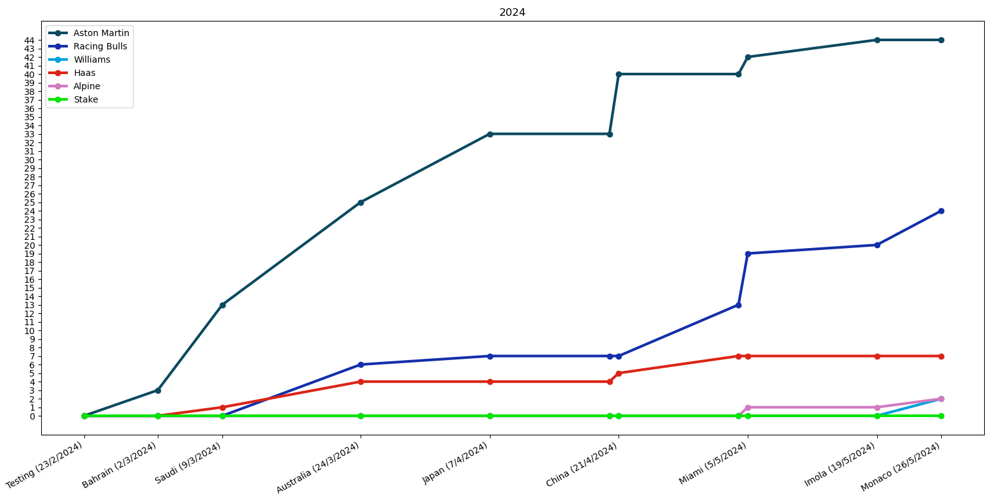
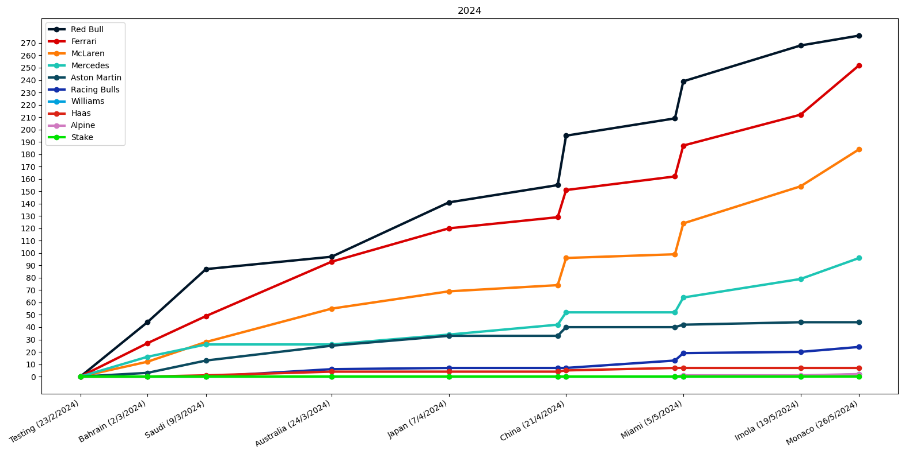

# F1 Points Over Time

Matplotlib graph to show F1 points over time.  
This is data that I am interested in and the project doubled up as an excuse for me to learn Matplotlib.

2023 season bottom four teams.  
The dotted vertical line is placed at 3/7/2023, the date I started at Scuderia AlphaTauri as an Intern Aero Systems / Software Engineer.

2023 Season with all teams.

2024 season bottom 6 teams so far (just after the Monaco GP).

2024 season so far with all teams.
